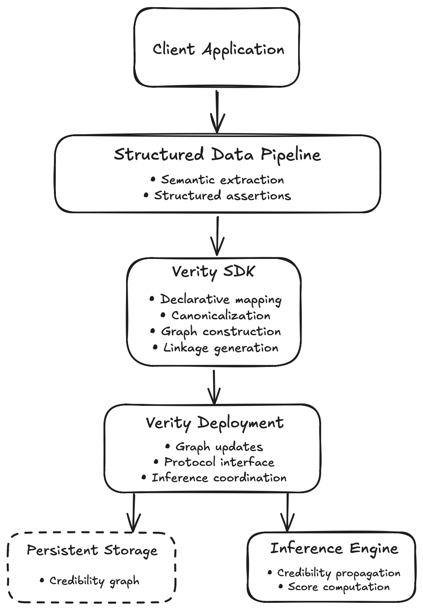

# Verity Architecture

## 1. Objectives

This document provides a high-level overview of the Verity architecture and defines major architectural components and their interactions.

The architecture is designed to compute structural credibility over structured assertions collected from various independent sources.

A main goal for Verity is to enable integration with existing structured data pipelines, regardless of application domain, programming language, or deployment environment used.

The architecture intends to satisy the following:

- Separating semantic extraction from credibility inference.
- Enabling deterministic graph construction through standardized canonicalization.
- Utilizing privacy-preserving linkage tokens instead of underlying content to preserve privacy.
- Supporting both self-hosted and cloud-based deployments.
- Maintaining a persistent credibility graph that evolves with the addition of new assertions.
- Producing deterministic credibility signals from graph topology.
- Scaling to large, continuously evolving credibility networks.
  
## 2. System Overview

At a high-level, Verity consists of four major architectural components:

- Client application
- Verity SDK
- Verity deployment
- Credibility inference engine

Client applications integrate the Verity SDK into existing structured data pipelines. The SDK is then responsible for performing deterministic canonicalization, constructing a credibility graph, generating privacy-preserving linkage tokens, and submitting graph updates to a Verity deployment.

A Verity deployment stores and maintains a persistent credibility graph as new assertions are submitted to the graph. The deployment then executes structural credibility inference and returns credibility signals to client applications. The credibility graph may be private to a single organization or shared across multiple participants depending on the deployment model used.

*Figure 1. High-level architecture of the Verity system.*

## 3. Components
- Host
- Existing Pipeline
- Verity SDK
- Verity Deployment
- Inference Engine
- Persistence Layer

## 4. End-to-End Workflow
- Existing pipeline
- Structured output
- Verity SDK
- Canonicalization
- OPRF
- Verity deployment
- Inference engine
- Credibility response
  
## 5. Graph Workflow
- Graph construction
- Graph evolution
- Snapshotting
- Recomputation

## 6. Deployment Options
- Self-hosting
- Cloud-based deployment

## 7. Trust Boundary
- Data crossing the trust boundary.
- Data that is not exposed to Verity.

## 8. Persistent Storage Model
- Graph storage
- Identifiers
- Linkage tokens
- Snapshots

## 9. Inference Workflow
- Graph updates
- Background recomputation
- Propagation
- Convergence
- Score publication

## 10. Failure Recovery

- Crash recovery
- Partial writes
- Idempotency
- Graph consistency

## 11. Scalability

- Incremental computation
- Parallel inference
- Horizontal scaling
