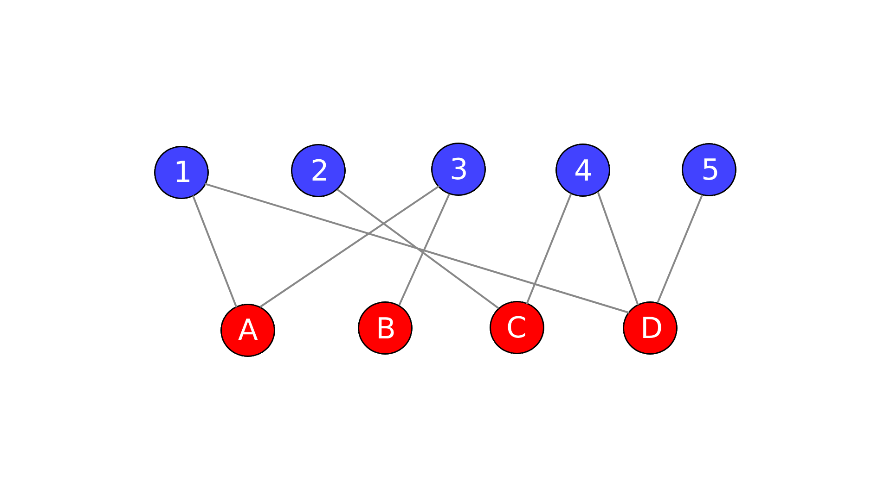

# Propagation Notes

Can credibility emerge naturally from repeated propagation across a graph of sources and claims?

Let's suppose a source asserts one or more claims. Those claims are in turn asserted by some other sources, which in turn assert other claims, and so on. These "assertions" create a connection between a source and a claim.

Can stable credibility emerge purely from the graph structure?

We can visualize the structure as a bipartite graph:

  

One iteration of propagation can be defined as:

- sources distribute credibility to claims
- claims redistribute accumulated support back to sources
- repeat until convergence

Some regions of the graph may reinforce themselves more strongly than others.

I'm currently experimenting with recursive update ideas like:

$$
c_j = \sum_i w_i A_{ij}
$$

$$
w_i^{(t+1)} \propto \sum_j c_j A_{ij}
$$

where claims reinforce sources and sources reinforce claims.

A challenge with iterative propagation, however, is that denser regions of the graph (e.g., "Claim Echo Loops" where sources copy one another) may carry greater influence than less connected regions. Similarly, claims appearing on a single source receive little or no reinforcement.

It is also important to note that agreement clearly does not imply independence. As said before, many sources may be copying the same misleading information. This results in the graph appearing highly confident despite a lack of independent verification.
